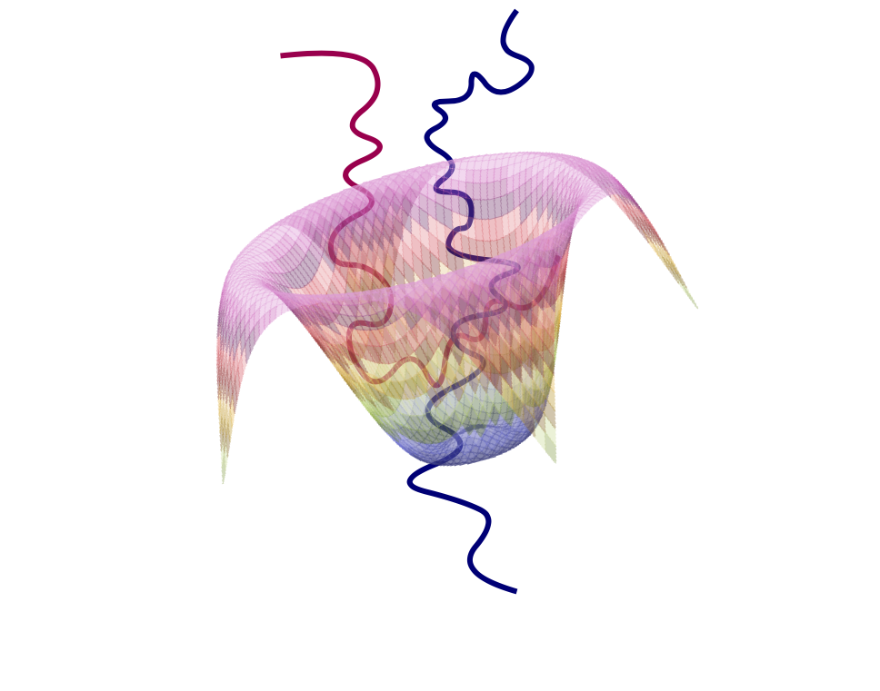

 

# SquiggleNet

SquiggleNet is a 1D ResNet based model to classify Oxford Nanopore raw electrical signals as target or non-target for Read-Until sequence enrichment or depletion. 

## Package Requirements

- Python >= 3.7
- Pytorch
- Scipy
- Numpy
- Glob
- Click
- Ont_fast5_api


## Inference
Use a pretrained model (two are available in the models folder, or you could use your own pretrained model) to make inference on fast5 files. To incorporate SquiggleNet into a read-until pipeline, simply run the model on the fast5 files returned by the MinKNOW API, then check the classification results to issue eject commands for the reads classified as non-target.

Options:
```python
  -m, --model PATH      The pretrained model path and name
  -i, --infile PATH     The input fast5 folder path
  -o, --outfile PATH    The output result folder path
  -b, --batch INTEGER   Batch size
  -c, --cutoff INTEGER  Cutoff the first c signals
  -ft, --format STRING  Raw file format (fast5, slow5)  
  --help                Show this message and exit.
```

Example:
```bash
python inference.py -m models/model_B4t2_3000_tot32.ckpt -i myfolder/fast5 -o outfolder
```

## Training

### Preprocessing
To accelerate the training process, the training dataset needs to be preprocessed into a well-formatted torch tensor. This requires ground truth labels for each read ID, input as two lists of read IDs respectively. The ground truth labels could be obtained through various ways, such as barcode labeling during sample preparation or running basecalled samples against Minimap2 or other alignment algorithms (though this method could introduce systematic errors caused by the alignment algorithm of your choice). 

Example:
```bash
python preprocess.py -gp groundtruth_pos.txt -gn groundtruth_neg.txt -i myfolder/fast5 -o outfolder
```

Options:
```python
  -gp, --gtPos TEXT     Ground truth list of positive read IDs
  -gn, --gtNeg TEXT     Ground trueh list of negative read IDs
  -i, --inpath TEXT     The input fast5 directory path
  -o, --outpath TEXT    The output pytorch tensor directory path
  -b, --batch INTEGER   Batch size, default 10000
  -c, --cutoff INTEGER  Cutoff the first c signals
  -ft, --format STRING  Raw file format (fast5, slow5)
  --help                Show this message and exit.
```

### Training
Run the trainer using the preprocessed dataset. Program auto-detects device and uses GPU whenever available. The option of fine tuning from a pre-trained checkpoint is also available.

Example:
```bash
python trainer.py -tt outfolder/pos_train.pt -nt outfolder/neg_train.pt -tv outfolder/pos_val.pt -nv outfolder/neg_val.pt -o trainedModel.ckpt
```

```python
  -tt, --tTrain PATH        The path of target sequence training set
  -tv, --tVal PATH          The path of target sequence validation set
  -nt, --nTrain PATH        The path of non-target sequence training set
  -nv, --nVal PATH          The path of non-target sequence validation set
  -o, --outpath TEXT        The output path and name for the best trained
                            model
  -i, --interm PATH         The path and name for model checkpoint (optional)
  -b, --batch INTEGER       Batch size, default 1000
  -e, --epoch INTEGER       Number of epoches, default 20
  -l, --learningrate FLOAT  Learning rate, default 1e-3
  --help                    Show this message and exit.
```

## Contributing
Pull requests are welcome. For major changes, please open an issue first to discuss what you would like to change. For further questions, please contact yuweibao@umich.edu.


## License
[MIT](https://choosealicense.com/licenses/mit/)

[](https://zenodo.org/badge/latestdoi/326563198)
